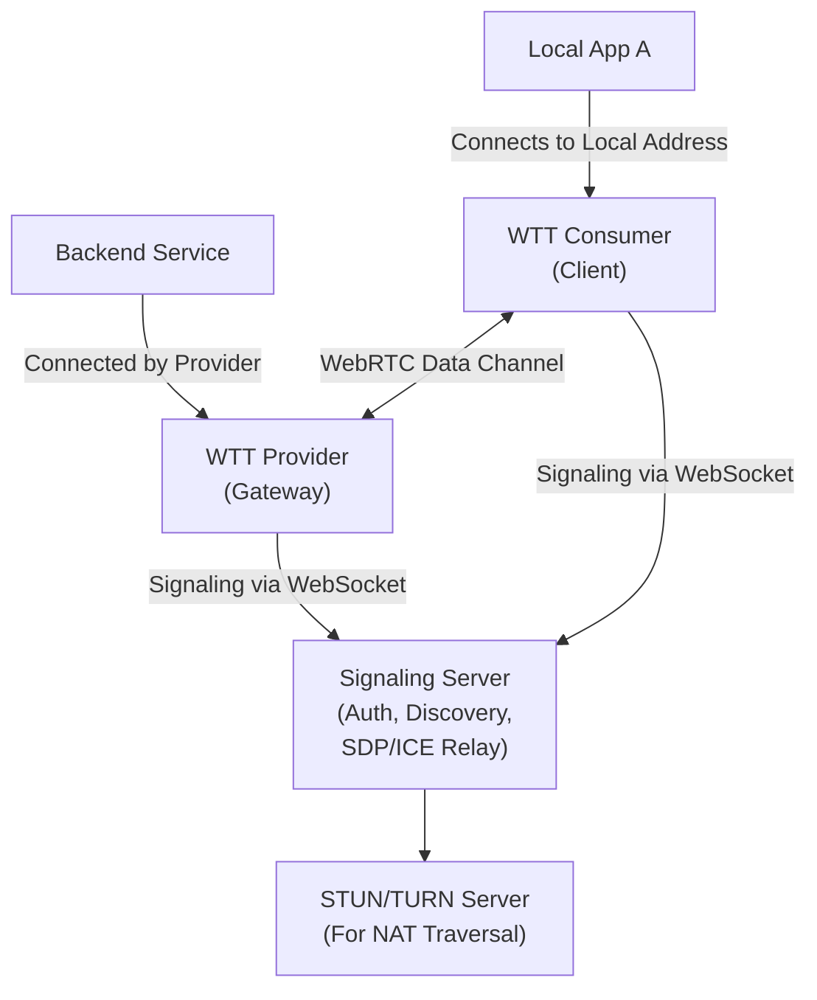

# WTT Design Specification

## 1\. Introduction

### 1.1. Project Goal

WTT (WebRTC Transport Tool) is a Layer 4 network forwarding tool built on the
WebRTC framework. The project aims to provide a stable, fast, cost-effective,
and user-friendly Peer-to-Peer (P2P) tunneling solution, enabling users to
securely and conveniently access internal services located in complex network
environments, such as behind a NAT or firewall.

### 1.2. Core Concept

WTT adopts a "Service Gateway" model. Its core philosophy is as follows:

- **Provider**: Deployed within a private network, it acts as a secure gateway.
  It does not listen on any inbound ports but instead "publishes" backend
  services within its network based on its configuration. When a connection is
  established, it proactively initiates outbound connections to the backend
  services.
- **Consumer**: Deployed on an external network, it acts as a client. It
  requests a connection using the abstract service name published by the
  Provider and securely maps the remote service to a local port for local
  applications to access.

This model significantly enhances security because the Provider side requires no
public exposure or inbound firewall rules, aligning with the best practices of a
Zero Trust network architecture.

### 1.3. Key Features

- **Maximum Security**: All data channels are end-to-end encrypted using
  WebRTC's built-in DTLS. The Provider only requires outbound connections,
  presenting no inbound attack surface.
- **Robust NAT Traversal**: Utilizes a combination of STUN and TURN technologies
  to achieve efficient NAT traversal, ensuring a high connection success rate
  across various complex network environments.
- **Protocol Support**: Supports forwarding for both TCP and UDP traffic.
- **Configuration-Driven**: Employs simple YAML files for declarative
  configuration, which is easy to understand and version-control.
- **Flexible Service Publishing**: A single Provider node can act as a gateway
  to publish multiple different services within its network.
- **Cross-Platform**: The client is developed in Go, providing native
  cross-platform support.
- **Multiple Interfaces**: Offers both a Terminal User Interface (TUI) and a
  Fyne-based Graphical User Interface (GUI).

### 1.4. Terminology

- **Peer Client**: The WTT client application, which can act as either a
  Provider or a Consumer.
- **Provider**: The peer client that publishes backend services and acts as a
  service gateway.
- **Consumer**: The peer client that subscribes to and uses services from a
  Provider.
- **Signaling Server**: A central server responsible for user authentication,
  client registration, service discovery, and the exchange of WebRTC signals.
- **PeerID**: A unique identifier assigned to each client after it connects to
  the signaling server.
- **Service Name**: A user-friendly, unique string identifier used by a Provider
  when publishing a service.
- **Target Address**: The actual network address of the backend service to be
  forwarded by the Provider (e.g., `tcp://192.168.1.10:3306`).
- **Local Address**: The address the Consumer listens on to map the remote
  service locally (e.g., `tcp://127.0.0.1:8080`).

## 2\. System Architecture

### 2.1. Architecture Overview

The system consists of four core components: the WTT clients (Provider and
Consumer), a Signaling Server, a STUN Server, and a TURN Server.



### 2.2. Component Details

#### 2.2.1. WTT Peer Client

Implemented in Go using the Pion library.

- **Provider (Service Gateway)**

  - **Responsibilities**:
    1. Parse the configuration to identify the list of
       `(Service Name, Target Address)` pairs to be published.
    2. Connect to the signaling server, authenticate, register, and report the
       list of available services.
    3. Listen for connection requests from the signaling server.
    4. Complete the WebRTC handshake with a Consumer to establish a P2P
       connection.
    5. Once the P2P connection is successful, connect to the corresponding
       backend service's target address based on the Consumer's requested
       service name.
    6. Perform bidirectional data forwarding between the WebRTC data channel and
       the backend service connection.

- **Consumer (Service Client)**

  - **Responsibilities**:
    1. Parse the configuration to identify the list of
       `(Local Address, Remote PeerID, Remote Service Name)` tuples to subscribe
       to.
    2. Connect to the signaling server, authenticate, and register.
    3. Send a connection request to the signaling server for a specific service
       on a specific Provider.
    4. Complete the WebRTC handshake with the Provider to establish a P2P
       connection.
    5. Once the P2P connection is successful, begin listening on the configured
       local address.
    6. When a local application connects to this address, perform bidirectional
       data forwarding between the local connection and the WebRTC data channel.

#### 2.2.2. Signaling Server

- **Responsibilities**:
  - **User Authentication**: Verifies user identity via OAuth Tokens.
  - **Client Management**: Accepts WebSocket connections and registrations from
    clients, assigns a `PeerID`, and maintains a list of online clients and the
    services they publish.
  - **Service Discovery**: Stores the list of services published by Providers
    and handles connection requests from Consumers.
  - **Signaling Relay**: Transparently relays WebRTC's SDP (Session Description
    Protocol) and ICE Candidate messages between peers.
  - **Management Interface**: Provides a RESTful API for remote management and
    monitoring.

#### 2.2.3. STUN/TURN Servers

- **STUN (Session Traversal Utilities for NAT)**: Helps clients discover their
  public IP address and port, which is the first step in establishing a P2P
  connection.
- **TURN (Traversal Using Relays around NAT)**: Acts as a data relay server when
  STUN fails (e.g., when both peers are behind symmetric NATs) and a direct P2P
  connection cannot be established. All traffic is then forwarded through the
  TURN server to ensure connectivity.

## 3\. Core Workflow

### 3.1. Connection and Service Publishing Flow

1. **Startup**: Provider-A and Consumer-B start and load their respective
   configuration files.
2. **Authentication**: Both peers request a temporary JWT for the WebSocket
   connection by authenticating with the signaling server's `/auth` endpoint
   using their user token.
3. **Registration**:
   - Both peers establish a WSS connection with the signaling server and send a
     `register` message to receive their respective `PeerID-A` and `PeerID-B`.
   - Provider-A sends an additional `publish_services` message to report its
     available services, e.g., `{"services": ["prod-mysql"]}`. The signaling
     server records the mapping `PeerID-A -> ["prod-mysql"]`.
4. **Initiate Connection**: Based on its configuration, Consumer-B sends a
   `request_connection` message to the signaling server with the content
   `{ "target_peer_id": "PeerID-A", "service_name": "prod-mysql" }`.
5. **Signaling Handshake**:
   - After verifying that `PeerID-A` offers the `prod-mysql` service, the
     signaling server forwards the connection request to Provider-A.
   - Provider-A accepts the connection and begins the WebRTC handshake. Both
     peers exchange SDP `Offer`/`Answer` and ICE Candidates through the
     signaling server.
6. **P2P Establishment**: The peers use the exchanged ICE information to attempt
   a direct P2P connection. If this fails, a relayed connection is established
   through a TURN server. The P2P tunnel is successfully established when the
   `PeerConnection` state changes to `Connected`.
7. **Data Pipeline Ready**:
   - **Consumer-B**: Once the `DataChannel` is open, it begins listening on its
     local address, `tcp://127.0.0.1:13306`.
   - **Provider-A**: Once the `DataChannel` is open, it looks up its
     configuration for the requested service name `prod-mysql` and connects to
     the target address `tcp://192.168.1.50:3306`.

### 3.2. Data Forwarding Flow

1. **Upstream Traffic**: A local application (e.g., a MySQL client) connects to
   Consumer-B at `127.0.0.1:13306`. Consumer-B sends the data packets received
   from this TCP connection to Provider-A through the encrypted `DataChannel`.
2. **Downstream Traffic**: Provider-A receives data packets from the
   `DataChannel` and writes them to its established TCP connection with the
   backend MySQL service. Response packets from the MySQL service return to
   Provider-A via this TCP connection, which then sends them back to Consumer-B
   through the `DataChannel`. Finally, Consumer-B writes the data back to the
   local application.

### 3.3. Disconnection and Reconnection

- **Normal Disconnection**: When a client is shut down or a user manually
  disconnects, it should gracefully close the `PeerConnection` and notify the
  signaling server that it is going offline.
- **Abnormal Disconnection**: Connection loss is detected via `PeerConnection`
  state checks or a `DataChannel` heartbeat mechanism. Clients should implement
  automatic reconnection logic, re-executing the workflow above to restore the
  connection.

## 4\. Detailed Component Design

### 4.1. Client Configuration (`config.yaml`)

```yaml
# Authentication information
auth:
    # User identity token used to obtain a session credential from the signaling server
    token: "your-secret-user-token"

# Signaling server address
signaling_server: "wss://wtt.example.com/ws"

# STUN/TURN server configuration
ice_servers:
    - urls: "stun:stun.l.google.com:19302"
    - urls: "turn:turn.example.com:3478"
      username: "turn-user"
      credential: "turn-password"

# Provider section
# Defines the backend services this client publishes as a service gateway
provide:
    - service_name: "prod-mysql" # The external service name, must be unique for the user
      target_address: "tcp://192.168.1.50:3306" # The actual internal address of the service

    - service_name: "internal-api"
      target_address: "tcp://10.0.0.5:8080"

# Consumer section
# Defines the remote services this client subscribes to and maps locally
consume:
    - name: "access-corp-db" # A friendly name for the local mapping, for local identification only
      local_address: "tcp://127.0.0.1:13306" # The local address and port to map to
      remote_peer_id: "provider-corp-main" # The PeerID of the target Provider
      remote_service_name: "prod-mysql" # The remote service name to connect to
```

### 4.2. Signaling Server API

- **REST API**
  - `POST /api/v1/auth`:
    - **Request**: `{ "token": "user-token" }`
    - **Response**: `{ "jwt": "session-jwt", "expires_in": 3600 }`
- **WebSocket Messages (JSON)**
  - **Client -\> Server**:
    - **Register**: `{ "type": "register", "jwt": "session-jwt" }`
    - **Publish Services**:
      `{ "type": "publish_services", "payload": { "services": ["svc1", "svc2"] } }`
    - **Request Connection**:
      `{ "type": "request_connection", "payload": { "target_peer_id": "...", "service_name": "..." } }`
    - **Signal Relay**:
      `{ "type": "signal", "payload": { "to_peer_id": "...", "data": { ...SDP or ICE... } } }`
  - **Server -\> Client**:
    - **Registration Successful**:
      `{ "type": "registered", "payload": { "peer_id": "...", "ice_servers": [...] } }`
    - **Connection Request**:
      `{ "type": "connection_request", "payload": { "from_peer_id": "...", "service_name": "..." } }`
    - **Signal Relay**:
      `{ "type": "signal", "payload": { "from_peer_id": "...", "data": { ...SDP or ICE... } } }`

## 5\. Security Design

- **Authentication and Authorization**:
  - User identity is verified with a long-lived `User Token`.
  - Each client session with the signaling server uses a short-lived `JWT` to
    mitigate the risk of token exposure.
  - The signaling server enforces access control to ensure users can only
    discover and connect to peers belonging to their own account.
- **Transport Security**:
  - **Signaling Channel**: All communication between clients and the signaling
    server (REST and WebSocket) must be encrypted using TLS (HTTPS/WSS).
  - **Data Channel**: All forwarded traffic between clients is end-to-end
    encrypted using WebRTC's built-in DTLS, making it indecipherable by the
    signaling server or any intermediary network devices.

## 6\. Technology Stack

- **Language**: Go
- **WebRTC Library**: Pion
- **WebSocket Library**: Gorilla WebSocket
- **Database**: SQLite

## 7\. Deployment and Operations

- **Deployment**: The signaling server and Coturn server will be packaged as
  Docker images and deployed with a single command using Docker Compose.
- **Scalability**: The signaling server has simple logic and can be scaled
  horizontally with a load balancer. The primary performance and cost bottleneck
  will be the TURN server's bandwidth, which should be monitored closely.
- **Monitoring**: Key metrics to monitor should include the number of online
  clients, the P2P direct connection success rate, TURN server traffic, and
  signaling API latency.
