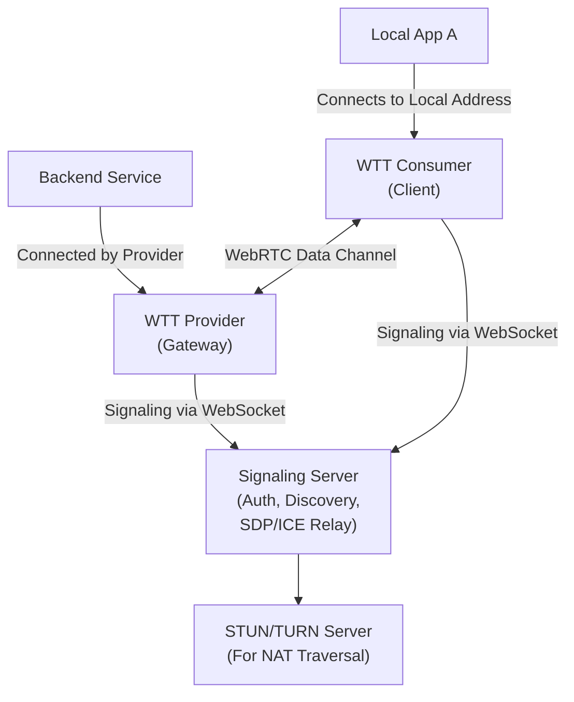

# WTT 设计规范

## 1\. 简介

### 1.1. 项目目标

WTT (WebRTC Transport Tool) 是一个基于 WebRTC 框架构建的 Layer 4
网络转发工具。项目旨在提供一个稳定、快速、经济、易用的 P2P (Peer-to-Peer)
隧道转发解决方案，使用户能够安全、便捷地访问位于复杂网络环境（如 NAT
或防火墙后）的内部服务。

### 1.2. 核心理念

WTT 采用“服务网关” (Service Gateway) 模式。其核心思想是：

- **服务提供方 (Provider)**:
  在私有网络内部署，作为安全网关。它不监听任何入站端口，而是根据配置“发布”其网络内的后端服务。当连接建立后，它会主动向后端服务发起出站连接。
- **服务使用方 (Consumer)**: 在外部网络部署，作为客户端。它通过 Provider
  发布的抽象服务名，请求建立连接，并将远程服务安全地映射到本地端口，供本地应用程序访问。

此模式极大提升了安全性，因为 Provider
侧无需任何公网暴露和入站防火墙规则，符合零信任（Zero Trust）网络架构的最佳实践。

### 1.3. 主要特性

- **极致安全**: 所有数据通道均通过 WebRTC 内建的 DTLS 进行端到端加密。Provider
  仅需出站连接，无入站攻击面。
- **强大穿透能力**: 综合利用 STUN 和 TURN 技术，实现高效的 NAT
  穿透，确保在各种复杂网络环境下的连接成功率。
- **协议支持**: 同时支持转发 TCP 和 UDP 流量。
- **配置驱动**: 通过简洁的 YAML 文件进行声明式配置，易于理解和版本控制。
- **灵活的服务发布**: 单个 Provider 节点可作为网关，发布其网络内的多个不同服务。
- **跨平台**: 客户端基于 Go 语言开发，天然支持跨平台运行。
- **丰富的界面**: 提供终端界面 (TUI) 和基于 Fyne 的图形界面 (GUI) 两种操作选项。

### 1.4. 术语定义

- **对等客户端 (Peer Client)**: WTT 客户端程序，可以扮演 Provider 或 Consumer
  角色。
- **服务提供方 (Provider)**: 发布后端服务、扮演服务网关角色的客户端。
- **服务使用方 (Consumer)**: 订阅并使用 Provider 服务的客户端。
- **信令服务器 (Signaling Server)**: 负责用户认证、客户端注册、服务发现和 WebRTC
  信令交换的中心服务器。
- **PeerID**: 每个客户端连接到信令服务器后获得的唯一身份标识。
- **服务名 (Service Name)**: Provider
  发布服务时使用的、对用户友好的唯一字符串标识。
- **目标地址 (Target Address)**: Provider 要转发的后端服务的实际网络地址，例如
  `tcp://192.168.1.10:3306`。
- **本地地址 (Local Address)**: Consumer
  用于在本地监听、映射远程服务的地址，例如 `tcp://127.0.0.1:8080`。

## 2\. 系统架构

### 2.1. 架构总览

系统由四个核心组件构成：WTT 客户端 (Provider 和 Consumer)、信令服务器、STUN
服务器和 TURN 服务器。



### 2.2. 组件详述

#### 2.2.1. WTT 对等客户端 (Peer Client)

基于 Go 和 Pion 库实现。

- **Provider (服务网关)**

  - 职责:
    1. 解析配置，明确要发布的 `(服务名, 目标地址)` 列表。
    2. 连接信令服务器，认证并注册，上报可提供的服务列表。
    3. 监听来自信令服务器的连接请求。
    4. 与 Consumer 完成 WebRTC 握手，建立 P2P 连接。
    5. P2P 连接成功后，根据 Consumer
       请求的服务名，主动连接到对应的后端服务目标地址。
    6. 在 WebRTC 数据通道和后端服务连接之间进行双向数据流转发。

- **Consumer (服务客户端)**

  - 职责:
    1. 解析配置，明确要订阅的 `(本地地址, 远端 PeerID, 远端服务名)` 列表。
    2. 连接信令服务器，认证并注册。
    3. 向信令服务器发起对特定 Provider 的特定服务的连接请求。
    4. 与 Provider 完成 WebRTC 握手，建立 P2P 连接。
    5. P2P 连接成功后，开始监听配置的本地地址。
    6. 当本地应用连接到该地址时，在本地连接和 WebRTC
       数据通道之间进行双向数据流转发。

#### 2.2.2. 信令服务器 (Signaling Server)

- 职责:
  - **用户认证**: 通过 OAuth Token 验证用户身份。
  - **客户端管理**: 接受客户端的 WebSocket 连接和注册，分配
    `PeerID`，维护在线客户端列表及其发布的服务信息。
  - **服务发现**: 存储 Provider 发布的服务列表，并处理 Consumer
    对服务的连接请求。
  - **信令转发**: 在 P2P 双方之间透明地中继 WebRTC 的 SDP (Session Description
    Protocol) 和 ICE Candidate 消息。
  - **管理接口**: 提供 RESTful API 用于远程管理和监控。

#### 2.2.3. STUN/TURN 服务器

- **STUN (Session Traversal Utilities for NAT)**: 帮助客户端发现其公网 IP
  地址和端口，是建立 P2P 连接的第一步。
- **TURN (Traversal Using Relays around NAT)**: 当 STUN 失败（例如双方都在对称型
  NAT 之后）无法建立直接 P2P 连接时，作为数据中继服务器。所有流量将通过 TURN
  服务器转发，确保连接的最终可达性。

## 3\. 核心工作流程

### 3.1. 连接与服务发布流程

1. **启动**: Provider-A 和 Consumer-B 启动，加载各自的配置文件。
2. **认证**: 双方使用用户 Token 向信令服务器 `/auth` 接口请求，获取用于
   WebSocket 连接的临时 JWT。
3. **注册**:
   - 双方与信令服务器建立 WSS 连接，并发送 `register` 消息进行注册，获得各自的
     `PeerID-A` 和 `PeerID-B`。
   - Provider-A 额外发送 `publish_services` 消息，上报其可提供的服务列表，例如
     `{"services": ["prod-mysql"]}`。信令服务器记录
     `PeerID-A -> ["prod-mysql"]`。
4. **发起连接**: Consumer-B 根据配置，向信令服务器发送 `request_connection`
   消息，内容为
   `{ "target_peer_id": "PeerID-A", "service_name": "prod-mysql" }`。
5. **信令握手**:
   - 信令服务器验证 `PeerID-A` 确实提供了 `prod-mysql` 服务后，将连接请求转发给
     Provider-A。
   - Provider-A 同意连接，开始 WebRTC 握手。双方通过信令服务器交换 SDP
     `Offer`/`Answer` 和 ICE Candidates。
6. **P2P 建立**: 双方利用交换的 ICE 信息尝试建立直接的 P2P
   连接。如果失败，则通过 TURN 服务器建立中继连接。当 `PeerConnection` 状态变为
   `Connected` 时，P2P 隧道建立成功。
7. **数据管道就绪**:
   - **Consumer-B**: `DataChannel` 打开后，开始监听其本地地址
     `tcp://127.0.0.1:13306`。
   - **Provider-A**: `DataChannel` 打开后，根据请求的服务名
     `prod-mysql`，查找自身配置，向目标地址 `tcp://192.168.1.50:3306` 发起连接。

### 3.2. 数据转发流程

1. **上行流量**: 本地应用（如 MySQL 客户端）连接到 Consumer-B 的
   `127.0.0.1:13306`。Consumer-B 将从此 TCP 连接收到的数据包通过加密的
   `DataChannel` 发送给 Provider-A。
2. **下行流量**: Provider-A 从 `DataChannel`
   收到数据包，然后将其写入到已建立的与后端 MySQL 服务的 TCP 连接中。MySQL
   服务的响应数据包通过此 TCP 连接返回给 Provider-A，Provider-A 再将其通过
   `DataChannel` 发回给 Consumer-B，最终由 Consumer-B 写回给本地应用。

### 3.3. 断开与重连

- **正常断开**: 客户端关闭或用户手动断开时，应主动关闭 `PeerConnection`
  并通知信令服务器下线。
- **异常断开**: 通过 `PeerConnection` 的状态检测或 `DataChannel`
  的心跳机制来发现连接丢失。客户端应实现自动重连逻辑，重新执行上述工作流程以恢复连接。

## 4\. 组件详细设计

### 4.1. 客户端配置 (`config.yaml`)

```yaml
# 认证信息
auth:
  # 用户身份令牌，用于向信令服务器获取会话凭证
  token: "your-secret-user-token"

# 信令服务器地址
signaling_server: "wss://wtt.example.com/ws"

# STUN/TURN 服务器配置
ice_servers:
  - urls: "stun:stun.l.google.com:19302"
  - urls: "turn:turn.example.com:3478"
    username: "turn-user"
    credential: "turn-password"

#  Provider 配置段
# 定义此客户端作为服务网关发布的后端服务
provide:
  - service_name: "prod-mysql" # 对外发布的服务名，在用户内必须唯一
    target_address: "tcp://192.168.1.50:3306" # 服务的真实内网地址

  - service_name: "internal-api"
    target_address: "tcp://10.0.0.5:8080"

#  Consumer 配置段
# 定义此客户端作为服务客户端要订阅和映射的远程服务
consume:
  - name: "access-corp-db" # 本地映射的友好名称，仅用于本地标识
    local_address: "tcp://127.0.0.1:13306" # 映射到本地的地址和端口
    remote_peer_id: "provider-corp-main" # 目标 Provider 的 PeerID
    remote_service_name: "prod-mysql" # 希望连接的远程服务名
```

### 4.2. 信令服务器 API

- **REST API**
  - `POST /api/v1/auth`:
    - **请求**: `{ "token": "user-token" }`
    - **响应**: `{ "jwt": "session-jwt", "expires_in": 3600 }`
- **WebSocket 消息 (JSON)**
  - **客户端 -\> 服务器**:
    - **注册**: `{ "type": "register", "jwt": "session-jwt" }`
    - **发布服务**:
      `{ "type": "publish_services", "payload": { "services": ["svc1", "svc2"] } }`
    - **请求连接**:
      `{ "type": "request_connection", "payload": { "target_peer_id": "...", "service_name": "..." } }`
    - **信令转发**:
      `{ "type": "signal", "payload": { "to_peer_id": "...", "data": { ...SDP or ICE... } } }`
  - **服务器 -\> 客户端**:
    - **注册成功**:
      `{ "type": "registered", "payload": { "peer_id": "...", "ice_servers": [...] } }`
    - **连接请求**:
      `{ "type": "connection_request", "payload": { "from_peer_id": "...", "service_name": "..." } }`
    - **信令转发**:
      `{ "type": "signal", "payload": { "from_peer_id": "...", "data": { ...SDP or ICE... } } }`

## 5\. 安全设计

- **认证与授权**:
  - 用户身份通过长效的 `User Token` 标识。
  - 客户端与信令服务器的每次会话都使用短效的 `JWT`，降低令牌泄露风险。
  - 信令服务器强制执行访问控制，确保用户只能发现和连接属于自己账户下的 Peer。
- **传输安全**:
  - **信令通道**: 客户端与信令服务器之间的所有通信（REST 和
    WebSocket）必须强制使用 TLS 加密 (HTTPS/WSS)。
  - **数据通道**: 客户端之间的所有转发流量均通过 WebRTC 内建的 DTLS
    进行端到端加密，信令服务器和任何中间网络设备都无法解密。

## 6\. 技术选型

- **语言**: Go
- **WebRTC 库**: Pion
- **WebSocket 库**: Gorilla WebSocket
- **数据库**: SQLite

## 7\. 部署与运维

- **部署**: 将信令服务器和 Coturn 服务器打包成 Docker 镜像，通过 Docker Compose
  进行一键部署。
- **可扩展性**:
  信令服务器逻辑简单，可通过负载均衡进行水平扩展。主要的性能和成本瓶颈在于 TURN
  服务器的带宽，应监控其使用率。
- **监控**: 关键监控指标应包括：在线客户端数量、P2P 直连成功率、TURN
  服务器流量、信令 API 延迟等。
